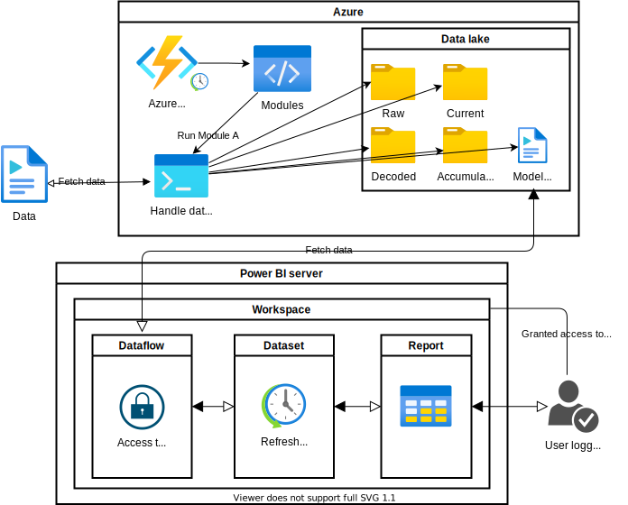
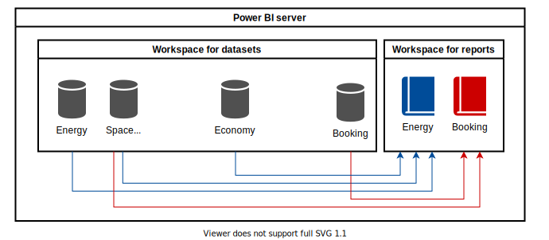

# 01: Integration between data lake and Power BI

## Azure
This diagram shows how an azure function gets data - could be from a web service, ftp or mail. Data gets washed and transformed to csv. Afterwards it gets saved into a data lake in a certain structure. A model.json file are made and that contains information about each csv-file and each column in the csv.

## Power BI server
This model.json binds Data lake and Power BI together through a Power BI dataflow.
A dataset gets established, that checks for update at the data lake up to 8 times per day. If there are any changes in the csv from data lake, it will be directly reflected down into the model.json and over to the dataset, so a new column will be visible in the dataset.
Now reports can be made, that uses data from the dataset. It is actually also possible to access the dataset through Excel and build a report here with live data.

## Accessibility
Users can only gain access to reports and datasets, if they have a Power BI license and are logged in to Excel or Power BI with there AAD account. This assures that data not can get out in an unsecure way.

## The befits of using multiple datasets

Reports are often made of data from multiple sources, so by splitting up data and reports, it becomes easier to:
* Reuse data in other reports
* To divide the work of building reports and maintaining data from the warehouse
