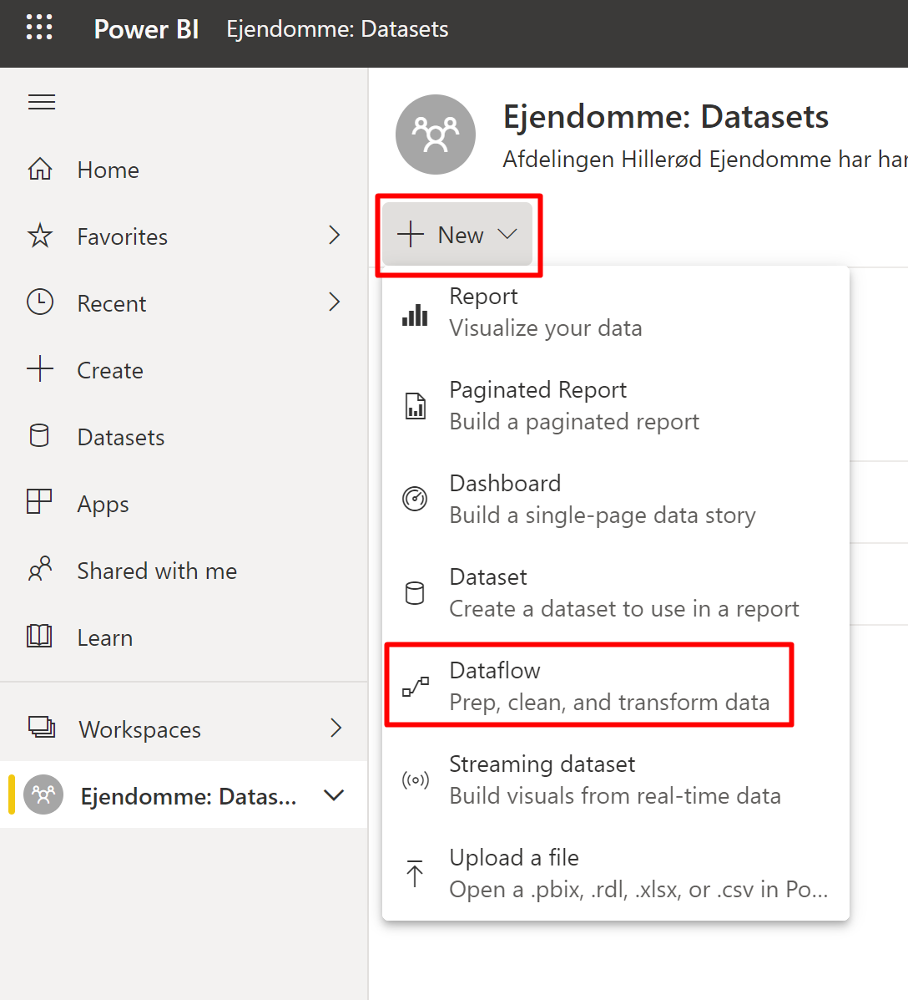
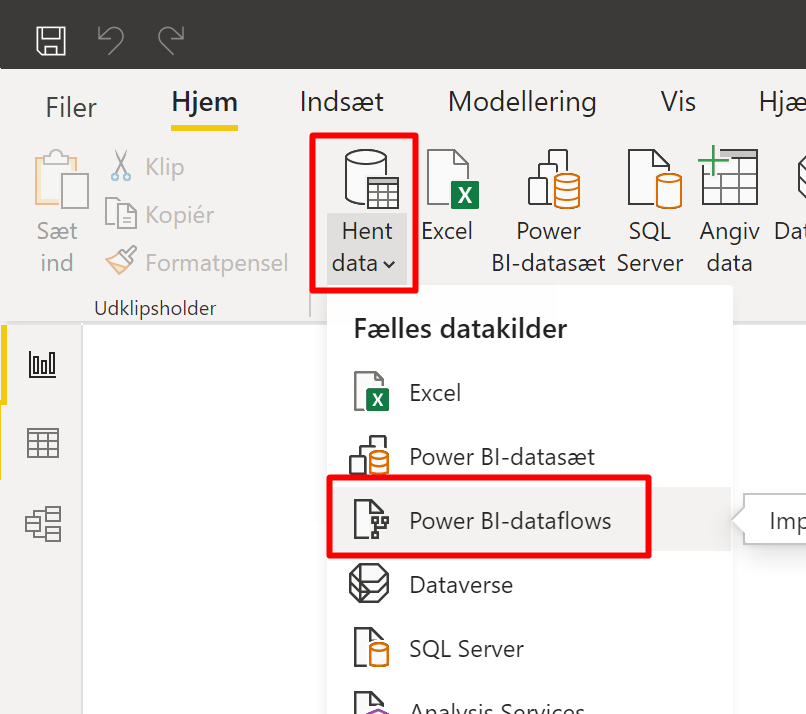
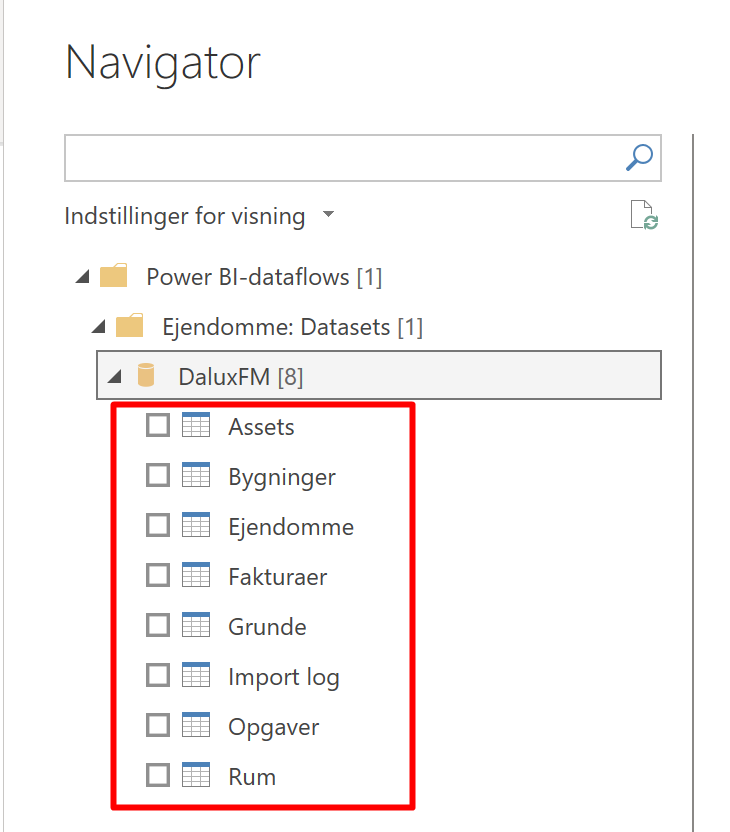
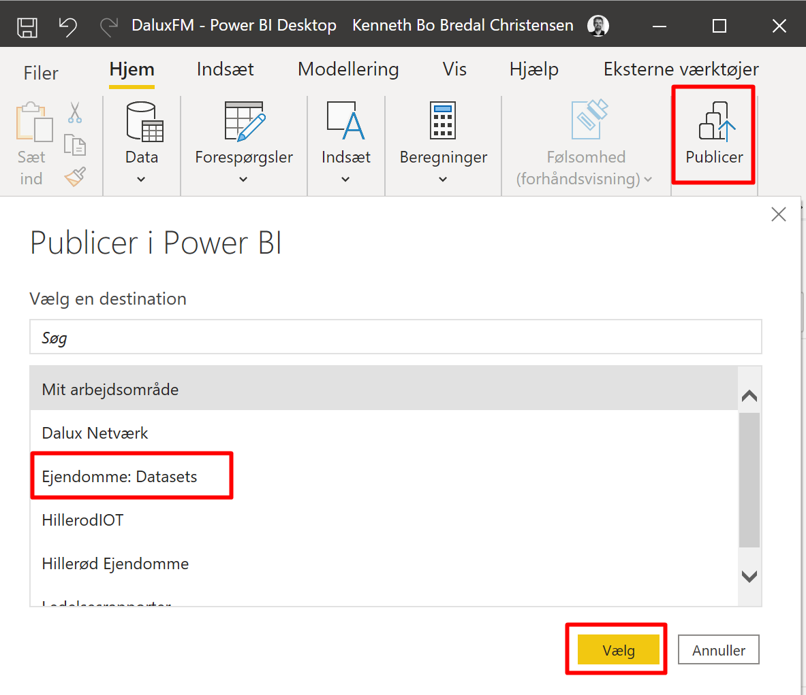
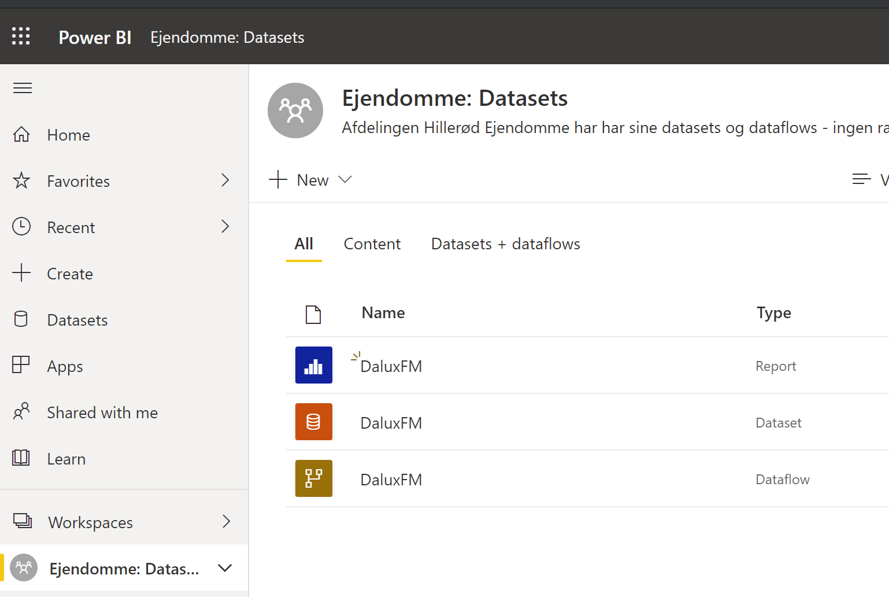
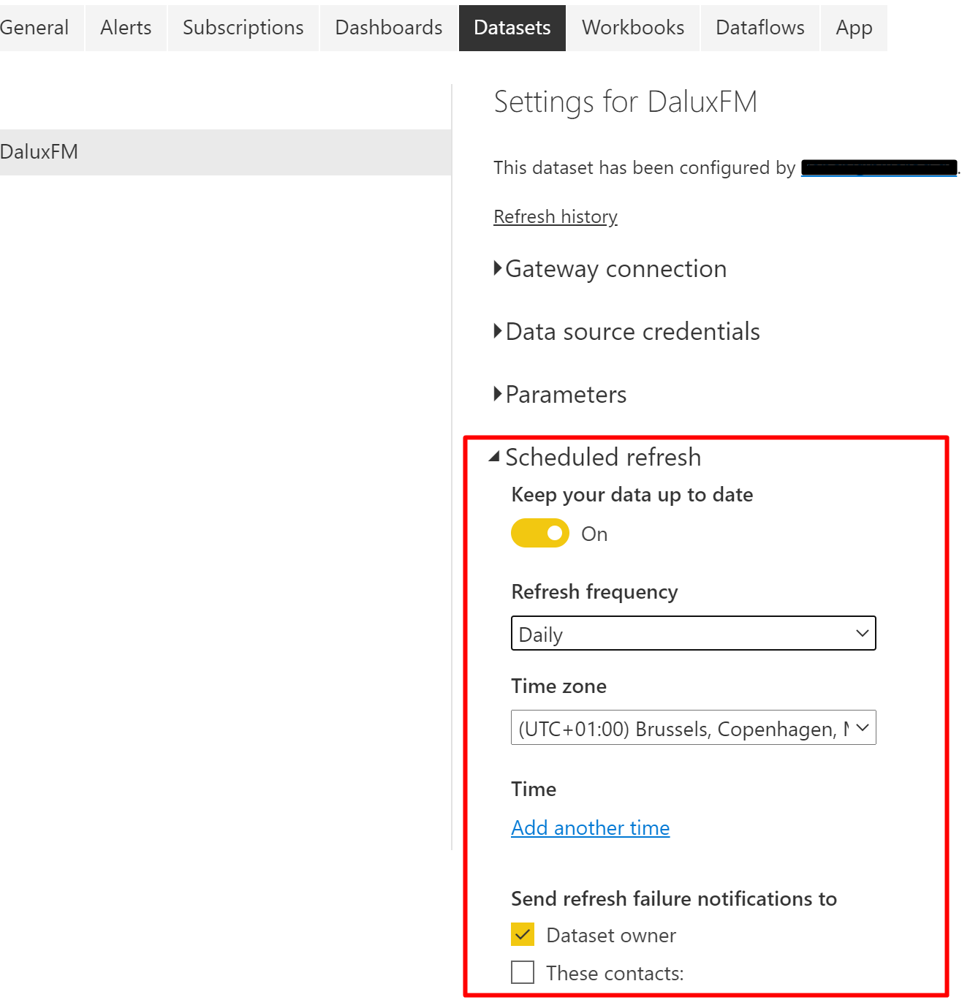
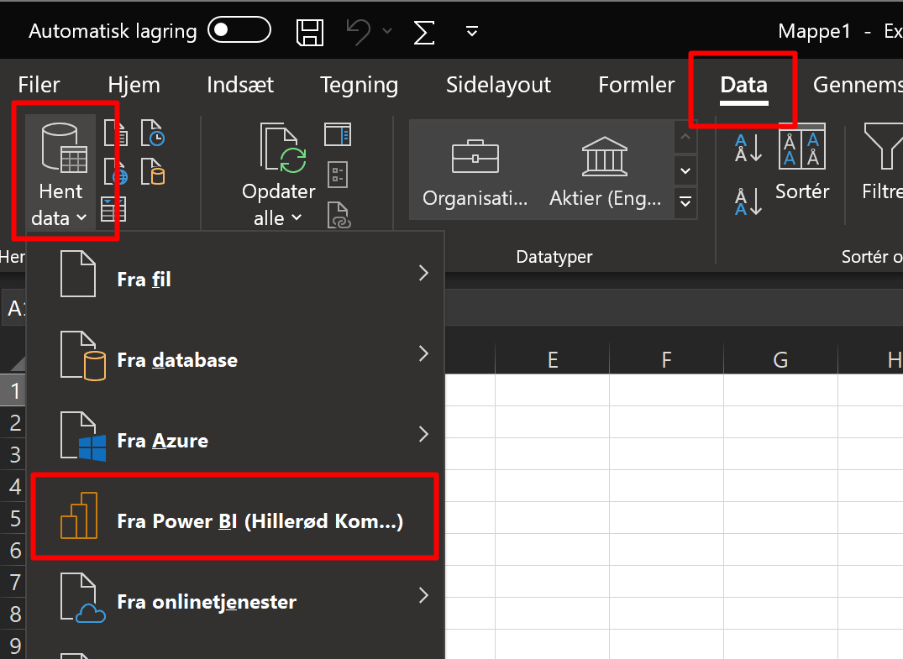
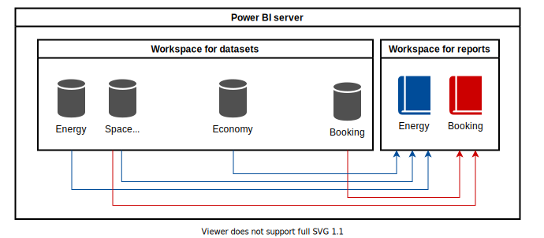
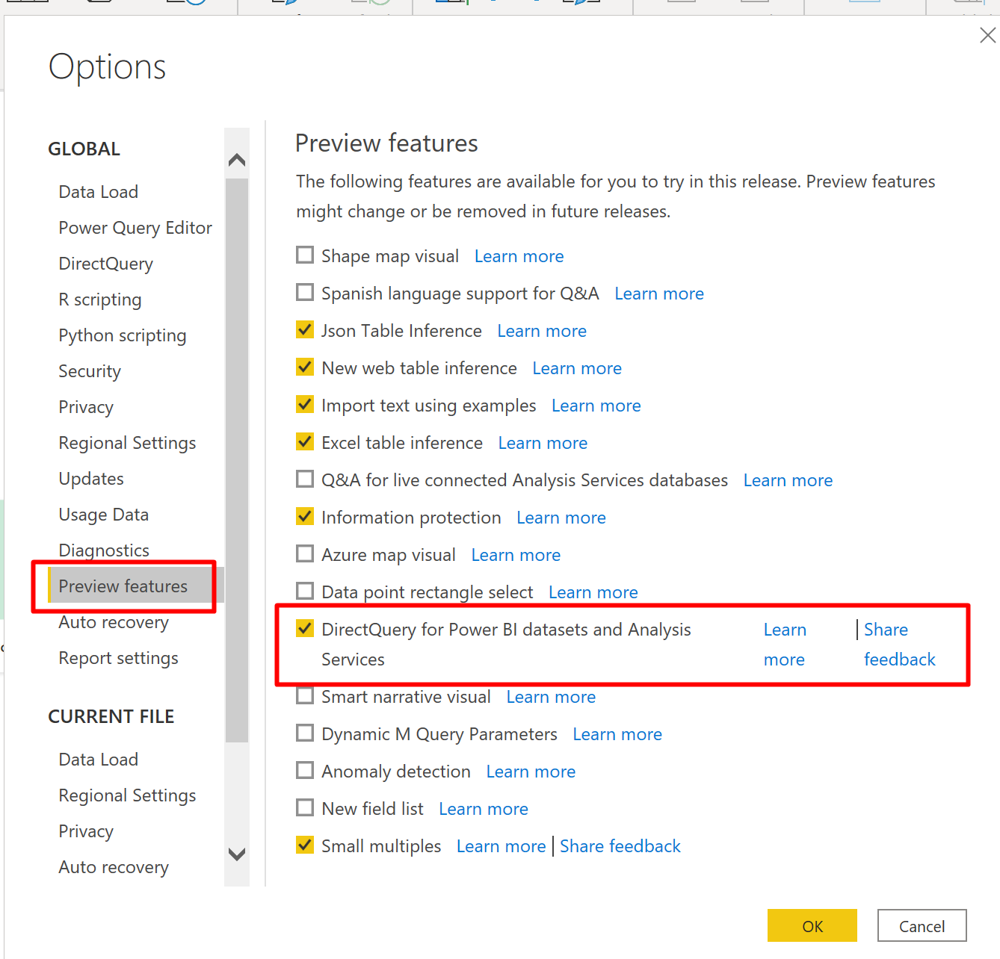

# From data lake to Power BI with data flows

## The goal
At my work, we have several systems to substantiate our business, like economy, space management, energy, task management, asset management - all systems that has it's own, isolated data. By combining all of these data in a central warehouse, we can achieve  tremendous insights for analysis and decision making.

## The troubles
Working with warehouse technology, are normally complicated and difficult to apprehend for employees. So in short terms, it is difficult for an employee to create a report, without the support from an analyst. And how about security and avoidance of data leak?

## A network group
We now have an IT-network, specifically for system owners in our department. Each owner becomes more aware of the importance of having correct data in their systems, and that their system are not an islands, but a part of a bigger structure, where systems relies more and more on each other. 
Our system owners, will require more reliant API's from vendors, so we don't have to build unstable robots to extract data to our data warehouse.
System owners becomes more aware of their responsibility to deliver correct data, and that will put focus on end users that delivers data - how can their workflows be optimised?

## A Power BI license
This setup need a [Power BI Pro license](https://powerbi.microsoft.com/en-us/pricing/) For approx. 8 dollars per month. You have to pay this amount for each user that should be able to view a report. If you have a Pro license, you can share a Power BI report with the hole internet, but it can easily give a data leak, so best not to do it:
[How to share a report with the whole internet](powerbi-share-report-on-internet.png)
If you grow larger, it will be possible to share reports with all in your organisation, with a Premium license to 60.000 dollars per year.

## Power BI Datasets
Power BI reports are often build upon data from spreadsheets, and after a while, the report becomes a recurring delivery, with time consuming data fetching from applications and subsequent questions about the correctness of data.

With our warehouse approach, a report gets data from formal datasets at our Power BI server. Datasets are collections of data from each of our applications. So to create a report that shows the spend on energy, it would be using a dataset from Economy and one from our Energy system. The data owner from Economy and from Energy, each has the response for correct data in their datasets, so when comes to questions to the correctness of data, each system owner, can either investigate some incorrectness or have a standard reply for more trivial questions. It is no longer the employee that makes the report, that also have to examine if data is correct.

## Datasets comes from Power BI data flows
Power BI recently launched the ability to fetch data from a common data model (CDM) from an Azure Data lake gen 2. You probably don´t have a data lake build upon CDM, but I will show the setup, just to give an idea of the process:

At Power BI server, create a workspace that are only for datasets. I call it "Ejendomme: Datasets" ('Ejendomme' is our department).

If you already have a CDM, you can make the dataflow here (it is only in preview, as I write):

In Power BI Desktop, you now create a report that uses the dataflow:

Select which tables from CDM, you want to fetch into the report:

Do some clean up of the data an you can create relationships between tables. Put in a text field that says "Only dataset":

Publish the report to your workspace:

There are now three items in the workspace, where one of them are the dataset. It comes from the report and you can actually delete the report, but leave it because it will come up every time you publish new changes:

Finally, select the dataset on the server and select Settings. Define how often the data should be fetched from the data lake and over to Power BI - it can be done as often as 8 times per day:

## Where to use datasets
You can specifically control which users has access to certain workspaces, containing specific datasets.
If an employee wants to make a report that uses a dataset, they have to login through there Power BI account. In a business setup, it would be there AAD credentials. The data from the Data Lake are accessibly in a secure setup:

It is actually possible to fetch a dataset directly into Excel as a pivot table. I think this is awesome because EVERYBODY knows Excel. Users also have to login with there AAD credentials to get data. they can setup their document, but it only contains data that are shown in the Pivot. The spreadsheet can be shared with readers outside the organisation, but they cannot load any more data from the data lake, if they are not granted permission from the workspace and has a tenant user.
If you are familiar with local pivot tables in Excel, you will be disappointed, because you have to setup a measure within the dataset, for each value you want to show.

## Reuse datasets to multiple reports
In this example, the Space management dataset are reused by two reports. With this approach:
1. The system owner for Space management, only have to facilitate a few datasets that all reports relies on.
2. The author of the Energy report only have to worry about the maintenance of the report - not the datasets.

Until now, is has only been possible to link to on dataset from a report, but this feature has just become available in preview-mode - and it's awesome!
Go to Options and turn it on:

Read more in this [blog](https://exceleratorbi.com.au/the-most-important-update-to-power-bi-desktop-ever/), where Matt Allington calls it "The most important update to Power BI desktop, ever!" :thumbsup: